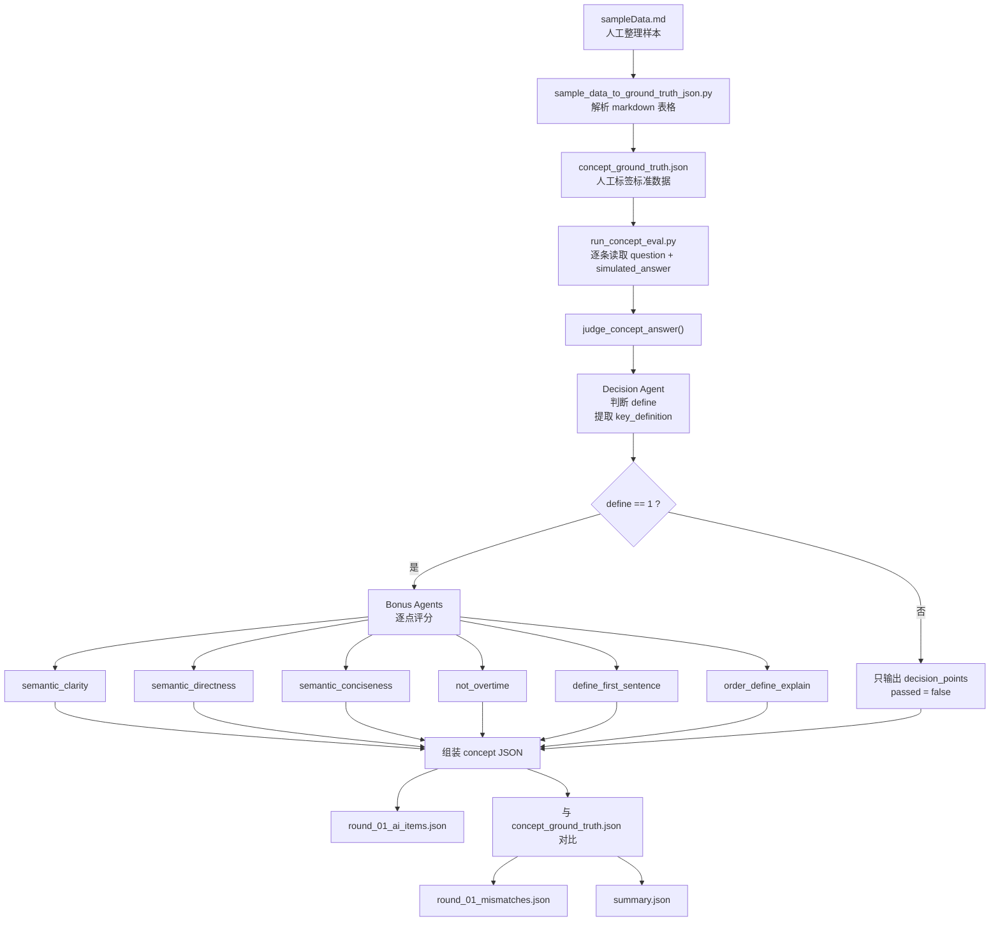

Issue (问题)：发生了什么？
对于瑕疵回答（即决定项正确，加分项部分正确的回答），概念题加分项打分不准确，应用题打分没有精细度，代码题打分结果实验尚未跑通。
Context (背景)：当时系统状态/限制条件是什么？
没有专家打分样本。
Decision (判断)：团队决定怎么处理？
现行解决概念题与应用题，概念题换架构。应用题要求回答STARE结构，实验STARE结构
Why (原因)：为什么这样选？(进度/风险/结构原因)
目前最佳方案

Owner (责任人)：Alex

概念题架构：
一个 decision agent 先判断决定项 `define`，如果回答相对正确，则提取候选人自己表述的核心定义 `key_definition`。之后多个 bonus agents 基于题目、回答、第一句和 `key_definition`，分别独立判断各个加分项。

概念题当前加分项命名：
- `semantic_clarity`：语义明确性
- `semantic_directness`：开门见山
- `semantic_conciseness`：语义精炼/不啰嗦
- `not_overtime`
- `define_first_sentence`
- `order_define_explain`

概念题输入/输出数据流：

概念题执行顺序：
1. 人工先在 `sampleData.md` 中整理题目、回答、决定项、加分项和备注。
2. 转换脚本把 markdown 样本转成 `concept_ground_truth.json`，作为人工标准答案。
3. `run_concept_eval.py` 读取每条样本，调用 `concept_multiagent_judger.py` 进行 AI 判分。
4. decision agent 先判断是否有定义，并抽取核心定义短语。
5. 如果决定项通过，再由多个 bonus agents 独立判断语义明确性、开门见山、语义精炼等加分项。
6. harness 将 AI 结果与人工标签对比，输出 `ai_items`、`mismatches`、`summary` 等评测文件。