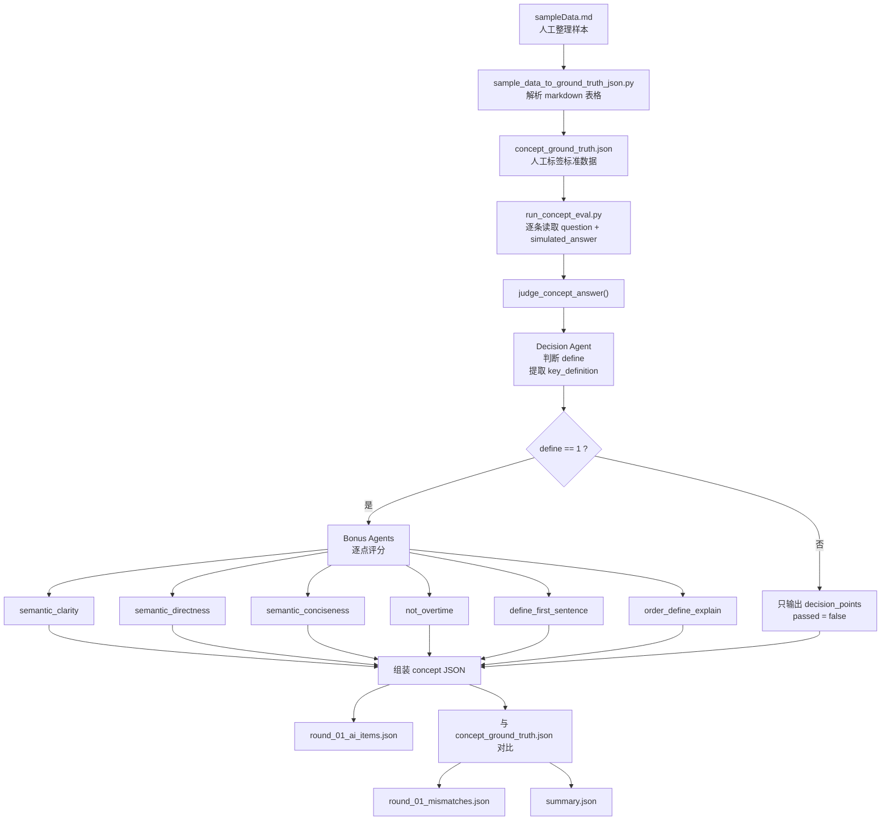
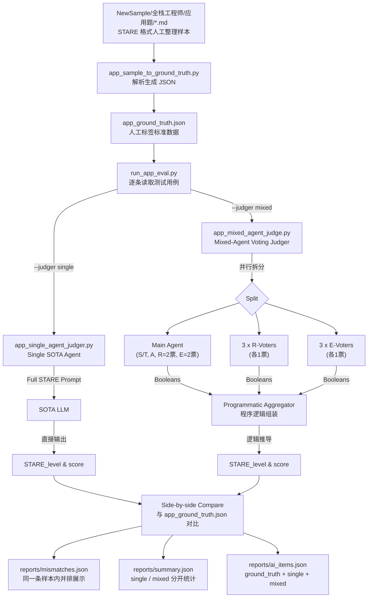

Issue (问题)：发生了什么？
对于瑕疵回答（即决定项正确，加分项部分正确的回答），概念题加分项打分不准确，应用题打分没有精细度，代码题打分结果实验尚未跑通。
Context (背景)：当时系统状态/限制条件是什么？
没有专家打分样本。
Decision (判断)：团队决定怎么处理？
现行解决概念题与应用题，概念题换架构。应用题要求回答STARE结构，实验STARE结构
Why (原因)：为什么这样选？(进度/风险/结构原因)
目前最佳方案


Owner (责任人)：Alex

概念题架构：
一个 decision agent 先判断决定项 `define`，如果回答相对正确，则提取候选人自己表述的核心定义 `key_definition`。之后多个 bonus agents 基于题目、回答、第一句和 `key_definition`，分别独立判断各个加分项。

概念题当前加分项命名：
- `semantic_clarity`：语义明确性
- `semantic_directness`：开门见山
- `semantic_conciseness`：语义精炼/不啰嗦
- `not_overtime`
- `define_first_sentence`
- `order_define_explain`

概念题输入/输出数据流：



概念题执行顺序：
1. 人工先在 `sampleData.md` 中整理题目、回答、决定项、加分项和备注。
2. 转换脚本把 markdown 样本转成 `concept_ground_truth.json`，作为人工标准答案。
3. `run_concept_eval.py` 读取每条样本，调用 `concept_multiagent_judger.py` 进行 AI 判分。
4. decision agent 先判断是否有定义，并抽取核心定义短语。
5. 如果决定项通过，再由多个 bonus agents 独立判断语义明确性、开门见山、语义精炼等加分项。
6. harness 将 AI 结果与人工标签对比，输出 `ai_items`、`mismatches`、`summary` 等评测文件。

---

应用题架构：
应用题采用 STARE 框架进行评分，不再使用传统的决定项/加分项模式，而是直接给出一个综合的 STARE 等级和分数。

STARE 框架定义：
- **S (Situation)** / **T (Task)**: 转述问题。成功描述清楚问题，并转述成功。
- **A (Action)**: 二选一选择方案。选择对的方案。
- **R (Result)**: (做什么) 该方案解决什么问题，带来什么好处。正确回答该方案的好处。
- **E (Evaluation)**: (为什么) 该方案为什么能解决问题，带来好处。在正确回答的基础上，给出对应的分析，并且分析正确。

STARE 评级与分数（从好到坏）：
- **STARE (3分)**: 完美的标准答案
- **STAR (2分)**: 知其然不知其所以然型答案，能正确地选择，并且意识到正确方案的核心优势，却不知道其优势的底层逻辑。
- **STA (1分)**: 有根据的猜测型答案，能完整地转述，并且有根据地猜测出正确答案，但不能提供任何证据。
- **ST/Others (0分)**: 只能转述问题，选错方案。
- **A (0分)**: 仅给出选项，没有转述问题。
- **Others (0分)**: 其余 (ST/A/ARE/AR)，不得分，如不能完成前三步（即 STA），即可视为乱蒙，乱猜，瞎说。

应用题输入/输出数据流（A/B 测试架构）：

为了对比不同 Agent 架构的评分效果，应用题设计了两种平行的 Judger 系统：
1. **Single SOTA Agent**: 将完整的 STARE 评分标准放入单个 Prompt，让单个大模型直接输出最终的 `STARE_level` 和 `score`。当前默认模型是 `gpt-5.4`。
2. **Mixed-Agent Voting Judger**: 为了解决单个大模型在 R 和 E 边界判断上的系统性偏差，采用“主 Agent (2票) + 3个 R 专属 Agent (各1票) + 3个 E 专属 Agent (各1票)”的投票机制。总计 5 票，得票 >= 4 视为通过。所有 Agent 均使用 `gpt-5.4`。
   - **R-Voters 视角**: 1) 是否陈述了表面影响/直接好处；2) 是否解决了题目描述的具体问题；3) 是否进行了结果层面的对比（更好/更快）。
   - **E-Voters 视角**: 1) 是否提及了底层技术机制/复杂度/数据结构；2) 是否进行了技术层面的 Trade-off 分析；3) 是否解释了“为什么”有效（只要正确且有一定深度即可）。
3. **(已废弃) Multi-Agent Parallel Judger**: 使用多个小模型并行判断 STARE 的各个组成部分，现已被 Mixed-Agent 取代。
4. **Driver Side-by-Side Comparison**: `run_app_eval.py` 默认会同时运行 Single 和 Mixed 两套架构（`--judger both`），并把同一条样本的 Ground Truth、Single 结果、Mixed 结果放在同一个输出对象里，便于横向比较。



应用题执行顺序：
1. `app_sample_to_ground_truth.py` 读取 `NewSample` 目录下的 Markdown 文件，提取题目、模拟回答、人工标注的 STARE 等级和分数，生成 `app_ground_truth.json`。
2. `run_app_eval.py` 作为评测驱动器，加载 Ground Truth 数据。
3. 驱动器根据命令行参数选择运行模式：`--judger single`、`--judger mixed`，或默认的 `--judger both`。
4. 在 `both` 模式下，driver 会对每条样本并发调用 `app_single_agent_judger.py` 和 `app_mixed_agent_judge.py`。
5. 两套 Judger 分别返回自己的 AI 预测等级、分数、理由与耗时。
6. 驱动器把 Ground Truth、Single 结果、Mixed 结果组装到同一条记录里，方便 side-by-side 比较。
7. 最后输出详细报告：`ai_items.json` 保存全量对照，`mismatches.json` 保存任一架构失配的样本，`summary.json` 分别统计 single 和 mixed 的准确率。

如何运行应用题评测：
```bash
# 1. 激活虚拟环境
source .venv/bin/activate

# 2. 导出 API Key (如果尚未导出)
export OPENAI_API_KEY="your_api_key_here"

# 3. 生成 Ground Truth JSON 数据
python AlternativeSolution/应用题/app_sample_to_ground_truth.py

# 4. 运行评测 (默认同时跑两套架构，并排比较)
python AlternativeSolution/应用题/run_app_eval.py --judger both

# 5. 如需只跑 Single SOTA Agent
python AlternativeSolution/应用题/run_app_eval.py --judger single

# 6. 如需只跑 Mixed-Agent Voting 架构
python AlternativeSolution/应用题/run_app_eval.py --judger mixed
```